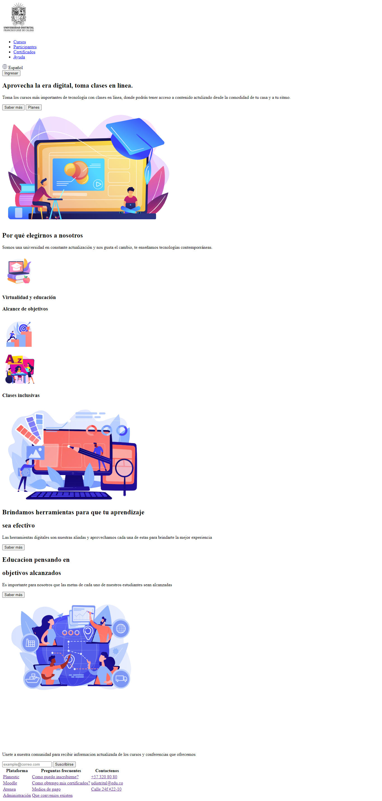

<h1>Taller 9 - Yefferson David Arevalo Rodriguez</h1>

<h2>Información</h2>

Curso: Full Stack Basico - Grupo1

Profesor: Cristian patiño

<h2>Link de la pagina Web</h2>

<h2>punto 1: link de Figma</h2>
<a href="https://www.figma.com/file/Y30NJHffiC39oV4HdwTVrm/Yefferson-Arevalo-Rodriguez?type=design&node-id=0%3A1&mode=design&t=rT5g9gd1HMpUFZdY-1">Link de Figma</a>

<h2>punto 2: Diseño en THML</h2>

<h2>punto 3: Diseño co CSS</h2>

<h2>punto 4: Títulos</h2>

<h2>punto 5: Párrafo</h2>

<h2>punto 6: Links</h2>

<h2>punto 7 y 8: Navegación</h2>

<h2>punto 9: Tabla</h2>